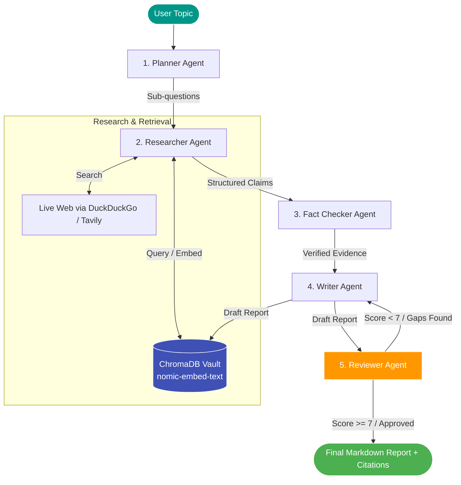

<div align="center">


# 🐾 MARAT
### Multi-Agent Research Assistant Technology
*Autonomous, cyclic deep-research intelligence driven by LangGraph, ChromaDB, and local or cloud LLMs.*  
*Guided by **Mara**, your clever, scholarly red panda companion.*

<br/>

[](https://python.org)
[](https://langchain.com)
[](https://fastapi.tiangolo.com)
[](https://ollama.com)
[](tests/)
[](https://astral.sh/ruff)
[](LICENSE)

<br/>

[**Meet Mara**](#-meet-mara) • [**Architecture**](#-architecture) • [**Agent Matrix**](#-agent-matrix) • [**Quickstart**](#-quickstart) • [**CLI Guide**](#-cli-usage) • [**API & Streaming**](#-rest-api--web-interface) • [**Configuration**](#-configuration)

</div>

---

## 🐾 Meet Mara

**Mara** is the spirit and mascot of MARAT — a studious, curious red panda equipped with round scholar glasses and a high-tech glowing research tablet. 

Mara coordinates a synchronized team of five specialized AI agents. From untangling ambiguous questions to verifying live web claims and proofreading synthesized reports, Mara ensures your research is:
- **Exhaustive:** Explores multiple angles without blind spots.
- **Fact-Checked:** Cross-references claims against live sources with confidence tags.
- **Ground-Truth Backed:** Integrates a persistent vector RAG vault for long-term institutional memory.
- **Quality-Guaranteed:** Enforces an autonomous peer-review revision loop before final delivery.

---

## 📐 Architecture

MARAT leverages **LangGraph's cyclic state machine** to build an adaptive, multi-agent pipeline with autonomous revision loops:



---

## 👥 Agent Matrix

| Agent | Icon | Role & Primary Responsibility | Output Artifact |
| :--- | :---: | :--- | :--- |
| **Planner** | 🧭 | Decomposes topics into non-overlapping, focused sub-questions. | JSON Sub-Question Schedule |
| **Researcher** | 🔍 | Executes bounded live web searches and local vector queries. | Extracted Claims & Source URLs |
| **Fact Checker** | ⚖️ | Cross-verifies claims, assigns confidence and verification tags. | `VERIFIED` / `UNVERIFIED` tags |
| **Writer** | ✍️ | Synthesizes polished Markdown reports with inline numeric citations. | Structured Research Report |
| **Reviewer** | 🧐 | Critiques structure, completeness, and rigor; controls revision loop. | Revision feedback or Approval |

---

## 🚀 Quickstart

### 1. Prerequisites
- **Python 3.11+** (Python 3.12 recommended)
- **Local Ollama** (default zero-cost option) or cloud API key (OpenAI / OpenRouter / Anthropic)

```bash
# Pull recommended local models with Ollama:
ollama pull llama3.2:3b
ollama pull nomic-embed-text
```

### 2. Installation

Clone and install dependencies via `pip` or `uv`:

```bash
# Clone the repository
git clone https://github.com/shivbu22/marat.git
cd marat

# Create virtual environment
python -m venv .venv
# Windows:
.\.venv\Scripts\activate
# Linux/macOS:
source .venv/bin/activate

# Install dependencies
pip install -r requirements.txt

# Copy environment config
cp .env.example .env
```

---

## 💻 CLI Usage

MARAT provides a modern, color-coded interactive CLI built with **Typer** and **Rich**:

```bash
# General help
python main.py --help

# Run an autonomous deep-research mission
python main.py research "Applications of LLMs in software engineering"

# Deep-dive focus mode without saving to disk
python main.py research "Quantum Computing error correction advances" --focus deep --no-save

# Start the FastAPI background server
python main.py serve --port 8000
```

---

## 🌐 REST API & Web Interface

Launch the high-performance asynchronous API server:

```bash
python main.py serve
# Live server: http://localhost:8000
# Interactive Swagger Documentation: http://localhost:8000/docs
```

### Endpoints

#### 1. System Health Check
```bash
curl http://localhost:8000/health
# Response: {"status": "ok", "provider": "ollama", "model": "llama3.2:3b"}
```

#### 2. Synchronous Research Job
```bash
curl -X POST http://localhost:8000/research \
  -H "Content-Type: application/json" \
  -d '{"topic": "Compare WebAssembly with Docker for edge computing", "focus_mode": "broad"}'
```

#### 3. Real-Time Server-Sent Events (SSE) Stream
```bash
curl -N -X POST http://localhost:8000/research/stream \
  -H "Content-Type: application/json" \
  -d '{"topic": "Autonomous AI Agents in Cybersecurity"}'
```

---

## ⚙️ Configuration

Configure providers and tuning parameters in `.env`:

```env
# ========== LLM Configuration ==========
LLM_PROVIDER=ollama                  # ollama | openai | openrouter | anthropic
LLM_MODEL=llama3.2:3b                # or gpt-4o, claude-3-5-sonnet, etc.
LLM_BASE_URL=http://localhost:11434/v1
LLM_API_KEY=ollama
TEMPERATURE=0.2

# ========== Search & Web Retrieval ==========
SEARCH_MAX_RESULTS=6
SEARCH_DEPTH=basic                   # basic | advanced
TAVILY_API_KEY=                      # optional, falls back to DuckDuckGo

# ========== Vector Store (ChromaDB) ==========
RAG_ENABLED=true
RAG_PERSIST_DIR=./data/chroma
RAG_COLLECTION=research_vault
EMBEDDING_MODEL=nomic-embed-text

# ========== Agent Behavior ==========
MAX_SUB_QUESTIONS=3                  # Sub-questions per research cycle
MAX_REVIEW_CYCLES=2                  # Maximum autonomous revision passes
PARALLEL_RESEARCHERS=true            # Concurrency managed by Semaphore
REQUIRE_SOURCES=true
```

---

## 🧪 Testing & Verification

MARAT includes a comprehensive 26-test unit and integration test suite:

```bash
# Run full test suite
pytest -v

# Run code format and quality checks
ruff check .
ruff format --check .
```

---

## 📁 Repository Structure

```
marat/
├── assets/
│   └── mara_mascot.png       # Official Mara mascot illustration
├── configs/
│   └── agents.yaml           # Agent roles, goals, and backstories
├── data/chroma/              # Persistent vector store (RAG vault)
├── reports/                  # Generated research Markdown reports
├── src/
│   ├── agents/
│   │   └── nodes.py          # Planner, Researcher, FactChecker, Writer, Reviewer
│   ├── api/
│   │   └── main.py           # FastAPI server + SSE streaming
│   ├── graph/
│   │   ├── state.py          # LangGraph shared state definitions
│   │   └── workflow.py       # StateGraph definition and cyclic routing
│   ├── rag/
│   │   └── store.py          # ChromaDB + Ollama/local embeddings
│   ├── tools/
│   │   └── search.py         # DuckDuckGo and Tavily web retrieval
│   ├── cli.py                # Typer & Rich terminal interface
│   ├── config.py             # Pydantic Settings
│   └── llm.py                # Multi-provider LLM factory & tag resolver
├── tests/                    # 26 unit and integration tests
├── .env.example              # Environment variables template
├── main.py                   # Main entry point
├── pyproject.toml            # Project packaging & tool configuration
├── requirements.txt          # Python dependencies
└── README.md                 # Documentation
```

---

<div align="center">

Made with ❤️ and guided by **Mara the Red Panda** 🐾  
Licensed under the [MIT License](LICENSE).

</div>
